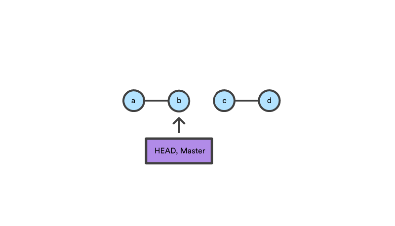

# Git Workshop


## Git Facts

- By far, the **most widely used modern version control system** in the world today is Git
- Git is a **mature, actively maintained open source project** originally developed in 2005 by Linus Torvalds
- Git is an example of a **DVCS (hence Distributed Version Control System)**. Rather than have only one single place for the full version history


- Every **developer's working copy of the code is also a repository** that can contain the full history of all changes

- Git **focuses on the file content itself** for determining the storage and version history (file names aren't so relevant) 

- Git uses a combination of **delta encoding** (storing content differences), **compression** and explicitly **stores directory contents and version metadata** objects.

  

  

- **Every checkout is a full backup of the repository**, hence multiple copies are available  (Implicit backup).

- Git **uses SHA1 algorithm** to secure the data stored within the repository.


- Git **branches are easy and cheap to merge**. Every small change to your code can be forked to a new branch.


---


### How to Create a Local Repo 

#### Git Repo from Scratch 

Let's start by creating a new .Net application just for demonstration purposes:

```bash
$ mkdir <code_path>  

$ dotnet new web -f net5.0

Welcome to .NET 5.0!
---------------------
SDK Version: 5.0.103

...
Restore succeeded.

```


Now we can initialize Git on this folder and create a brand new local repository:

```bash
$ git init
Initialized empty Git repository in $PATH/.git/  
```


Once the repo is rolled out, Git will start tracking the files stored on it. Now we can check the repo status:

```bash
$ git status
On branch master

No commits yet

Untracked files:
  (use "git add <file>..." to include in what will be committed)
        Program.cs
        Properties/
        Startup.cs
        appsettings.Development.json
        appsettings.json
        git-workshop.csproj
        obj/

nothing added to commit but untracked files present (use "git add" to track)

```


Before we move forward, lets shed some light on some important components and concepts:

* **.git directory**

  * Contains all the information that is necessary for your project in version control and all the information about commits, remote repository address, etc. All of them are present in this folder. It also contains a log that stores your commit history so that you can roll back to history.

* **.gitignore file**

  * Specifies intentionally untracked files that Git should ignore. Files already tracked by Git are not affected.

    ```text
    *.swp
    project.lock.json
    nupkg/
    
    # Visual Studio Code
    .vscode
    
    # Build results
    [Dd]ebug/
    ```

* **User name and E-mail Definitions**

  * To set your global username/email configuration:

  ```shell
  # Set your username:
  $ git config --global user.name "FIRST_NAME LAST_NAME"
  
  # Set your email address:
  $ git config --global user.email "MY_NAME@example.com"
  ```

  * To set your repo-wide username/email configuration, just ommit the `--global`flag.

    

* **.git/config file**

  * The local Git configuration file is simply named *config,* and like the system Git config file, has no extension

  * ```
    [core]
            repositoryformatversion = 0
            filemode = true
            bare = false
            logallrefupdates = true
            ignorecase = true
            precomposeunicode = true
    [user]
            name = Lucas Albuquerque
            email = lucas@email.com
    
    ```

  

---


### Working Directories and Staging

The **Working Directory** is a single checkout of one version of the project.

- Working Directory is the current local directory that you are working on
- If you have **master, dev and yourname-dev** as branches, if you move from **dev** to **yourname-dev**, **yourname-dev** becomes your working directory. 
- And then if you checkout (move) from this (**yourname-dev**) working directory to **dev**, **dev** becomes your new working directory.

Before commiting data stored on your Working Directory, you need to stage the data. To ***stage*** a file is simply to prepare it finely for a commit. Staging is a step before the commit process in git. 


Before commiting to Git, the files need to be moved to the staging are using `git add` command:

```bash
# Staging a single file
$ git add Startup.cs

# Staging a directory
$ git add obj

# Staging all files (except files which name begin with a dot)
$ git add *
```


After staging the files, check the local repo status:

```bash
$ git status

On branch master

No commits yet

Changes to be committed:
  (use "git rm --cached <file>..." to unstage)
        new file:   Program.cs
        new file:   Properties/launchSettings.json
        new file:   Startup.cs
        new file:   appsettings.Development.json
        new file:   appsettings.json
        new file:   git-workshop.csproj
        new file:   obj/git-workshop.csproj.nuget.dgspec.json
        new file:   obj/git-workshop.csproj.nuget.g.props
        new file:   obj/git-workshop.csproj.nuget.g.targets
        new file:   obj/project.assets.json
        new file:   obj/project.nuget.cache

```


If you notice, the output above informs that there are files added but **yet to be committed**. To commit staged files, run the command `git commit` followed by the commit message, as shown below:

```bash
 $ git commit -m "my first commit"
 
[master (root-commit) 0fe6b13] my first commit
 10 files changed, 258 insertions(+)
 create mode 100644 Properties/launchSettings.json
 create mode 100644 Startup.cs
 create mode 100644 appsettings.Development.json
 create mode 100644 appsettings.json
 create mode 100644 git-workshop.csproj
 create mode 100644 obj/git-workshop.csproj.nuget.dgspec.json
 create mode 100644 obj/git-workshop.csproj.nuget.g.props
 create mode 100644 obj/git-workshop.csproj.nuget.g.targets
 create mode 100644 obj/project.assets.json
 create mode 100644 obj/project.nuget.cache

```

 

You can also notice that there is only a single Working Directory created, which is **Master**. This is the default branch and initial Working Directory created by Git. However, some vendors define the default branch with different names (e.g. **Main**, **Trunk**, **Stable**, ...).

What we did so far was:

1. Initiatialize a new Git repo;
2. Add files from the Working Directory (Master) to Staging area;
3. Commit the staged area to Git;


Now the `git status` command should look like below, meaning that there is nothing to commit on the Master Working Directory.

```bash
$ git status
On branch master
nothing to commit, working tree clean

```

In order we can check the commits history, we can check the logs for the repo:

```bash
$ git log

commit 49b1dd865214118ff473891e28d498bb0282d21f (HEAD -> master)
Author: Lucas Albuquerque <lucas@email.com>
Date:   Thu Mar 25 16:04:51 2021 +0100

    my second commit

commit 0fe6b13e709ae7530f14ddddebf5a17ecb80cc63
Author: Lucas Albuquerque <lucas@email.com>
Date:   Thu Mar 25 13:29:48 2021 +0100

    my first commit

```

Based on the output, you can verify which commit is the **HEAD** of the repo. The **HEAD** points out the last commit in the current checkout branch. It is like a pointer to any reference. The **HEAD** can be understood as the "current branch." When you switch branches with 'checkout,' the **HEAD** is transferred to the tip of the new branch.


----


### Branches

Git **branches** are effectively a pointer to a snapshot of your changes. Instead of copying files from directory to directory, **Git** stores a **branch** as a reference to a commit. In this sense, a **branch** represents the tip of a series of commits—it's not a container for commits.

A branch represents an **independent line of development**. Branches serve as **an abstraction** for the edit/stage/commit process. You can think of them as a way to request **a brand new working directory, staging area, and project history**. New **commits are recorded in the history** of the current branch, which results in **a fork in the history** of the project.


New branches can be created using the command `git branch`, followed by the branch name. And then you can check the existent branches:

```bash
$ git branch feature-1

$ git branch -l
  feature-1
* master
(END)

```

Notice an asterisks besides the **master** branch, which indicates that this is your current Working Directory. For switching to the new **feature-1** branch, the `checkout` command. You can also inform the source which you want to branch off from.

```bash
$ git checkout feature-1
Switched to branch 'feature-1'

$ git branch -l
* feature-1
  master
(END)
```

As you can see, the working directory now is **feature-1** and you can also confirm this by checking the status:

```bash
$ git status
On branch feature-1
nothing to commit, working tree clean
```

Alternatively, you can create and swith to a new branch running a single command:

```bash
$ git checkout -b feature-1
```


Now you can safely work on your code on **feature-1** branch without interfere on your Master branch. You can perfom as many changes as you want, add and commit the code as you please. Just for demonstration, after making a change on `Startup.cs` file, this is the output from `git status`command:

```bash
$ git status
On branch feature-1
Changes not staged for commit:
  (use "git add <file>..." to update what will be committed)
  (use "git restore <file>..." to discard changes in working directory)
        modified:   Startup.cs

no changes added to commit (use "git add" and/or "git commit -a")

```

Stage the file and followed by a commit. Bear in mind that the commit message must describe the changes made preferably with a comprehensive description and/or ticket number on your issue/task tracking system. 

```bash
$ git add Startup.cs

$ git commit -m "Updating the default banner upon audit request #12345"
[feature-1 6632109] Updating the default banner upon audit request #12345
1 file changed, 1 insertion(+), 1 deletion(-)

```

Now you can check the logs and check the commits history:

```bash
$ git log
commit 6632109cc8d8acdd43b14cd6c65e936754acd7be (HEAD -> feature-1)
Author: Lucas Albuquerque <lucas@email.com>
Date:   Thu Mar 25 16:46:55 2021 +0100

    Updating the default banner upon audit request #12345

commit 49b1dd865214118ff473891e28d498bb0282d21f (master)
Author: Lucas Albuquerque <lucas@email.com>
Date:   Thu Mar 25 16:04:51 2021 +0100

    my second commit

commit 0fe6b13e709ae7530f14ddddebf5a17ecb80cc63
Author: Lucas Albuquerque <lucas@email.com>
Date:   Thu Mar 25 13:29:48 2021 +0100

    my first commit

```


Notice that the current **HEAD** is pointing to **feature-1**, which is the current Working Directory. Also, the **feature-1** branch inherited the commits history existent on the **master** branch, from where it was derivated. For comparison purposes, you can switch back to **master** and check the logs. You will see only two commits.

```bash
$ git checkout master
Switched to branch 'master'

$ git log

commit 49b1dd865214118ff473891e28d498bb0282d21f (HEAD -> master)
Author: Lucas Albuquerque <lucas@email.com>
Date:   Thu Mar 25 16:04:51 2021 +0100

    my second commit

commit 0fe6b13e709ae7530f14ddddebf5a17ecb80cc63
Author: Lucas Albuquerque <lucas@email.com>
Date:   Thu Mar 25 13:29:48 2021 +0100

    my first commit


```


As you can see, the **feature-1** and **master** are now following different tracks, but their paths will can come across again soon in the future. 


----


### Merge and Rebase

The first thing to understand about `git rebase` is that it solves the same problem as `git merge`. Both of these commands are designed to integrate changes from one branch into another branch—<u>they just do it in very different ways</u>.

Consider what happens when you start working on a new feature in a dedicated branch, then another team member updates the `master` branch with new commits. This results in a forked history, which should be familiar


Now, let’s say that the new commits in `master` are relevant to the feature that you’re working on. To incorporate the new commits into your `feature` branch, you have two options: merging or rebasing.

**Git merge** will combine multiple sequences of commits into another branch. In the most frequent use cases, **git merge** is used to combine two branches. Once **Git** finds a common base commit it will create a new "**merge** commit" that combines the changes of each queued **merge** commit sequence.

Consider the example below, where we are merging branch **feature-1** into **master**:

```bash
$ git checkout master
Switched to branch 'master'

$ git merge feature-1 
Updating 49b1dd8..6632109
Fast-forward
 Startup.cs | 2 +-
 1 file changed, 1 insertion(+), 1 deletion(-)
 
```


After the merge has completed, you'll be able to check the `status` and the `log`: 

```bash

$ git status
On branch master
nothing to commit, working tree clean

$ git log
commit 6632109cc8d8acdd43b14cd6c65e936754acd7be (HEAD -> master, feature-1)
Author: Lucas Albuquerque <lucas@email.com>
Date:   Thu Mar 25 16:46:55 2021 +0100

    Updating the default banner upon audit request #12345

commit 49b1dd865214118ff473891e28d498bb0282d21f
Author: Lucas Albuquerque <lucas@email.com>
Date:   Thu Mar 25 16:04:51 2021 +0100

    my second commit

commit 0fe6b13e709ae7530f14ddddebf5a17ecb80cc63
Author: Lucas Albuquerque <lucas@email.com>
Date:   Thu Mar 25 13:29:48 2021 +0100

    my first commit
(END)


```


As you can notice, the `git merge` command has consolidated the two branches and also preserving the commits ID (e.g. *6632109*). However, there are situations when the number of commits on the source branch is too much, merging the commits can turn the log history a bit messy (specially when there are multiple developers working on the same code). In that cases, `git merge` gives us the option of squashing the commit history.

```bash
$ git checkout master
Switched to branch 'master'

$ git merge --squash feature-1
Updating 6632109..6850019
Fast-forward
Squash commit -- not updating HEAD
...
 
$ git commit -m "Merging and squashing the content from feature-1"
[master 670e699] Merging and squashing the content from feature-1
...
```

As you can see, after running the `git merge` with the squash parameter, the about-to-be merged files were left at the staging area awaiting for being committed. All the merged files will be brought to the repo under a single commit, no matter the original commits they were related to at the source branch.

As previously mentioned, another alternative to merging code from distinct branches together is `git rebase`. Git rebase basically changes the parent of the first commit on your branch. So git rebase master will change the parent of the first commit of your branch to the latest commit on the master branch. 

Let's consider the same code as shown before, and apply `git rebase` for merging the code. After creating the branch **feature-1**, new commits were added to both branches (**feature-1** and **master**), forking their histories. In order we can bring their history together and creating a linear timeline, the branches have to be rebased. 


For accomplishing this using our code, we have to run `git rebase` command from **feature-1** making reference to **master** as the source branch.

```bash
$ git checkout feature-1
Switched to branch 'feature-1'

$ git rebase master
Successfully rebased and updated refs/heads/feature-1.
```

The rebase command above will merge the code from **master** branch into **feature-1** but creating a linear timeline of all commits existent on both branches, including any commit added after the initial fork. The default action is picking all the found commits and add them to the branch timeline. 

However, the real power of rebase is the option for merging the code in a more granular way. This can be done by running rebase in an interactive mode.

```bash
$ git rebase -i master
```

The command above will open an editor with all the commits found in **feature-1** branch and ask you which action must be taken for each. Since you can choose the individual actions, the commits can be merged, reworded, squashed, etc, as you pleased.

```
pick bb99302 adding f1
pick ea0b5e7 adding f2
pick fc81389 adding f3

# Rebase 588c00d..fc81389 onto 588c00d (3 commands)
#
# Commands:
# p, pick <commit> = use commit
# r, reword <commit> = use commit, but edit the commit message
# e, edit <commit> = use commit, but stop for amending
# s, squash <commit> = use commit, but meld into previous commit
# f, fixup <commit> = like "squash", but discard this commit's log message
...
```


But watch out... there are some remarks worth making about rebase:

* The advantage of this method is that your history will stay one straight line, on the other hand it won’t be possible to figure out later, that a git rebase happened;
* Once you understand what rebasing is, the most important thing to learn is **when *not* to do it**. The golden rule of `git rebase` is to **never use it on *public* branches** [[!]](https://www.atlassian.com/git/tutorials/merging-vs-rebasing#the-golden-rule-of-rebasing).


---

### Stashing 

**Stash** temporarily shelves (or stashes) changes you've made to your working copy so you can work on something else, and then come back and re-apply them later on. The `git stash` command can help you to (temporarily but safely) store your uncommitted local changes - and leave you with a clean working copy.

```bash
$ git stash  
Saved working directory and index state \
  "WIP on master: 049d078 Create index file"
...

# for "naming" a stash
$ git stash push -m "my_stash"
```

For checking the existent stashes, you can list them:

```bash
$ git stash list
stash@{0}: On feature-1: my_stash
```

Git's Stash is meant as a temporary storage. When you're ready to continue where you left off, you can restore the saved state easily:

```bash
$ git stash pop
```

The "pop" flag will reapply the *last saved* state and, at the same time, delete its representation on the Stash. In case you want to apply a specific Stash item (not the latest one), you can provide the index name of that item in the "pop" option:

```bash
$ git stash pop stash@{2}
```


For converting a stash into a branch

```bash
$ git stash branch <branch_name>
```


----


### Collaboration using Git

To be able to collaborate on any Git project, you need to know how to manage your remote repositories. Remote repositories are versions of your project that are hosted on the Internet or network somewhere. You can have several of them, each of which generally is either read-only or read/write for you. Also, some of them can be private only, which you won't be able to access the content without authorization. 

There are many vendors that offer enterprise Git hosted services, such as [Github](http://github.com/), [Gitlab](https://about.gitlab.com/), [BitBucket](https://bitbucket.org/), and also open-source alternatives like [Gitea](https://gitea.io/en-us/). The connection between repos are generally made using either HTTPS or SSH protocols. For most vendors, SSH is the recommended connection method, since it involves the use of Public and Private keys for authentication. Please check the documentation provided by the vendor for connecting to remote repositories using Git.

For connecting a remote repo to a remote one, there are some two options:

1. Cloning the repo to your local environment, creating a **local** repo and pulling the remote content along with the config.

```bash
$ git clone https://github.com/Azure-Samples/storage-blobs-dotnet-webapp

Cloning into 'storage-blobs-dotnet-webapp'...
remote: Enumerating objects: 688, done.
remote: Total 688 (delta 0), reused 0 (delta 0), pack-reused 688
Receiving objects: 100% (688/688), 36.51 MiB | 22.74 MiB/s, done.
Resolving deltas: 100% (210/210), done.

$ cd storage-blobs-dotnet-webapp
$ git remote %
origin

```


2. Adding an *upstream* repo as **remote** to your existent local repository:

```bash
# Check the existent remotes
$ git remote -v

# Adding a remote as origin
$ git remote add origin https://github.com/lucasalbuq/myrepo

# Push the content to remote
$ git push -u origin

```


After having the local repo connected to a remote, you can inspect a remote repo and check the existent branches:

```bash
$ git remote show origin
* remote origin
  Fetch URL: https://github.com/Azure-Samples/storage-blobs-dotnet-webapp
  Push  URL: https://github.com/Azure-Samples/storage-blobs-dotnet-webapp
  HEAD branch: master
  Remote branches:
    dependabot/nuget/WebApp-Storage-DotNet/bootstrap-3.4.1 tracked
    master                                                 tracked
...

```


----

### Fetch, Pull and Push

**git fetch** really only downloads new data from a remote repository - but it doesn't integrate any of this new data into your working files. Fetch is great for getting a fresh view of all the things that happened in a remote repository.

```bash
$ git fetch origin
```

Fetch will never manipulate, destroy, or screw up anything. This means it is harmless. For instance, you can update branches available between the local and remote repos by running `git fetch` with prune argument.

```bash
$ git fetch --prune
```


**git pull**, in contrast, is used with a different goal in mind: to update your current HEAD branch with the latest changes from the remote server. This means that pull not only downloads new data; it also directly **integrates** it into your current working copy files.

```bash
$ git pull origin
```

Some remarks about `git pull` command:

- Can lead to "merge conflict" since it tries to merge remote changes with your local ones [[!]](https://www.git-tower.com/learn/git/ebook/en/command-line/advanced-topics/merge-conflicts/);
- You should *not* have any uncommitted local changes before you pull. `git stash` can help with that;


**git push** command is used to transfer or push the commit, which is made on a local branch in your computer to a remote repository.

```bash
$ git push origin
```

One remark: 

* Always make sure that your local repo is up-to-date with the remote before pushing changes;


---

### Pull Requests

Whether you’re collaborating on a work assignment with colleagues or contributing to an open-source project, chances are that you will be operating in the following scenario. You make local code changes and then submit those changes to a remote project maintainer for review before those changes are implemented, or merged.

A **Pull Request** (**PR**) (sometimes called **Merge Requests**), is a review request. You are asking someone to check the changes on a branch before merging into another branch. While pull requests are not a core feature of Git, they are commonplace when it comes to collaborating with Git hosting services. 

The usual workflow is:

1. A developer adds the code to a dedicated branch in their local repo.
2. The developer pushes the branch to the remote repository.
3. The developer files a Pull Request (PR) using the vendor UI.
4. The rest of the team reviews the code, discusses it, and alters it.
5. The project maintainer merges the feature into the official repository and closes the pull request.


Considering our local code, **feature-1** branch can be pushed to remote in order a new PR can be created.

```bash
$ git checkout feature-1
Switched to branch 'feature-1'

# Listing the local and remote branches
$ git branch -a
* feature-1
  master
  remotes/origin/master

# Push feature-1 branch to origin
$ git push -u origin feature-1
...
remote: Resolving deltas: 100% (4/4), completed with 1 local object.
remote:
remote: Create a pull request for 'feature-1' on GitHub by visiting:
remote:      https://github.com/hutger/git-workshop/pull/new/feature-1
remote:
To https://github.com/hutger/git-workshop.git
 * [new branch]      feature-1 -> feature-1
Branch 'feature-1' set up to track remote branch 'feature-1' from 'origin'.

```


The output shows that the code was succesfully pushed to origin and a new PR can be open for merging the code into **Master**. 


After the PR is created, a reviewer will be able to review the code and approve the PR, as show below:


## Extras


### Tags 

Tags are ref's that point to a **specific moment in Git history**. Some facts about tags:

* Tagging is generally used to **capture a point** in history - Version release (i.e. v2.0.2);
* A tag is like a branch that **doesn’t change**;
* Unlike branches, tags, **after being created**, have **no further history** of commits;


`git tag` can be used for adding a tag for the current HEAD. This is called *Annotated Tag* and stores full objects in the Git database. It stores extra metadata such as: the tagger name, email, date and GPG signatures:

```bash
# Annotated Tag
$ git tag -a v1.4 -m "my version 1.4"
```

For a more simple tagging, the *Lightweight Tag* can be used, which create a new tag checksum and store it in the `.git/` directory of the project's repo.

```bash
# Lightweight Tag
$ git tag v1.4-lw
```


For listing all tags in a repo the command `git tag` can be used. Like a branch, you can also `checkout` to a tagged version.

```bash
$ git tag
v0.10.0
v0.10.0-rc1
v0.11.0
...

$ git checkout v0.11.0

```


Once the tag is applied, the version can be pushed to remote:

```bash
$ git push origin v1.4
...
     * [new tag]         v1.4 -> v1.4
```


### Alias

Aliases enable more efficient workflows by requiring fewer keystrokes to execute a command. 

For a brief example, consider the `git checkout` command. The checkout command is a frequently used git command, which adds up in cumulative keystrokes over time. An alias can be created that maps `git co` to `git checkout`, which saves precious human fingertip power.

```bash
$ git config --global alias.co checkout
$ git config --global alias.br branch
$ git config --global alias.ci commit
$ git config --global alias.st status
```

Very handy in cases when you need to run long commands in a regular basis

```bash
$ git config --global alias.lg "log --graph --pretty=format:'%Cred%h%Creset -%C(yellow)%d%Creset %s %Cgreen(%cr) %C(bold blue)<%an>%Creset' --abbrev-commit"

$ git lg
```


### Revert

`git revert` command is used for undoing changes to a repository's commit history.

A revert operation will take the specified commit, **inverse the changes from that commit**, and create a new "revert commit". The ref pointers are then updated to point at the new revert commit making it the tip of the branch. Considering the sequence of commits below, which `86bb32e` is the latest, a change can be reverted to a previous commit using `git revert HEAD` command.

```bash
$ git log --oneline
86bb32e prepend content to demo file
3602d88 add new content to demo file
299b15f initial commit

$ git revert HEAD
[master b9cd081] Revert "prepend content to demo file" 
1 file changed, 1 deletion(-)

$ git log --oneline 
1061e79 Revert "prepend content to demo file" 
86bb32e prepend content to demo file 
3602d88 add new content to demo file 
299b15f initial commit

```

Reverting has two important advantages over resetting. First, **it doesn’t change the project history**. Second, `git revert` is able to **target an individual commit** at an arbitrary point in history.


### Rm

`git rm` command is used to remove files from a Git repository. It can be thought of as the **inverse of the `git add`** command.

It can be used to remove individual files or a collection of files. The primary function of `git rm` is to remove tracked files from the Git index. The `git rm` command operates on the current branch only. The removal event is only applied to the working directory and staging index trees. The file removal is not persisted in the repository history until a new commit is created.

```bash
$ git rm Documentation/\*.txt

# Relevant arguments
# --cached = specifies that the removal should happen only on the staging index
# --force = override the safety check that Git makes
# --dry-run = is a safeguard that will execute the git rm command but not actually delete the files
```


### Reset

`git reset` resets current HEAD to the specified state.  It is similar in behavior to `git checkout`. Where `git checkout` solely operates on the `HEAD` ref pointer, `git reset` will move the `HEAD` ref pointer and the current branch ref pointer.


#### Git Workflow


This example demonstrates a sequence of commits on the `master` branch. The `HEAD` ref and `master` branch ref currently point to commit d. Now let us execute and compare, both `git checkout b` and `git reset b.`


#### Git Checkout B


With `git checkout`, the `master` ref is still pointing to `d`. The `HEAD` ref has been moved, and now points at commit `b`. The repo is now in a 'detached `HEAD`' state.


#### Git Reset B




Comparatively, `git reset`, **moves both the `HEAD` and branch refs to the specified commit**. In addition to updating the commit ref pointers, `git reset` will modify the state of the three trees. The ref pointer modification always happens and is an update to the third tree, the Commit tree. 

For resetting a previously commited action, a simple `git reset` can be performed, which is equivalent to `git reset --mixed HEAD`

```bash
# The simplest way - equivalent to `git reset --mixed`
$ git reset
```


The command line arguments `--soft, --mixed`, and `--hard` direct how to modify the Staging Index, and Working Directory trees.

* **--hard** = This is the most direct, DANGEROUS. The Commit History ref pointers are updated to the specified commit. Then, the **Staging Index and Working Directory are reset** to match that of the specified commit. Any **previously pending changes to the Staging Index and the Working Directory gets reset** to match the state of the Commit Tree. 
* **--mixed** = This is the default operating mode. The ref pointers are updated. The **Staging Index is reset to the state of the specified commit**. Any **changes that have been undone from the Staging Index are moved to the Working Directory**.
* **--soft** = the **ref pointers are updated and the reset stops there**. The Staging Index and the Working Directory are left untouched. 

Some remarks: 

- `git reset` is designed to undo local changes to the Staging Index and Working Directory. 
- You should never use `git reset` when any snapshots after have been pushed to a public repository.


----


## Best Practices


#### Make clean, single-purpose commits

Focus on keeping commits as small and focused as possible for many reasons, including:

- It makes it easier for other people in the team looking at your change, making **code reviews more efficient**.
- If the commit has to be **rolled back** completely, it’s far **easier** to do so.
- It’s straightforward to **track** these **changes** with your ticketing system.
- Make `git log` better readable 

#### Write meaningful commit messages

**Concisely describe** what **changes** are being made as part of a commit make life easier for others as well as your future self. If using a ticketing system, also include the ticket id in the description (Tasks/Issues to Commits).

#### Commit early, commit often

It is better to work in **small chunks** and keep **committing** your work. Helps you on keeping your code updated with the latest changes so that you avoid conflicts. helps you from losing work, reverting changes, and helping trace what you did when using `git-reflog`

#### Don’t alter published history

**Do not  alter history** after commit has been **merged to an upstream** default branch (and is visible to others). Use carefully `git rebase` and `git reset` features.

#### Don’t commit generated files

As a rule of thumb, only **files that cannot be re-generated** should be commited to git. This applies to *cache*, *dumps*, *temp files*, *objects* and *artifacts*. 

Make sure that the paths for those files and directories are included to **.ignore** file.

#### Sensitive Information

Be extra careful with files containing sensitive information. Those files **must never be commited**. This rule applies to **passwords, tokens, keys, certificates**,.... Preferably **no sensitive information** should be written in the code (**hard-coded**), but supplied using a different method (Environment variables, injected, etc) during the application rollout. 

In case hard-coded sensitive information is required, **encrypt** the information before the commit and/or make sure that the files are included in to **.gitinore** file. 


#### Code Signing

If you’re taking work from others on the internet and want to verify that commits are actually from a trusted source, Git has a few ways to **sign and verify work using GPG**.

```bash
# Generating a GPG key
$ gpg --gen-key

# Add the signing key to Git
$ git config --global user.signingkey 0A46826A

# Signing Tags
$ git tag -s v2.0 -m 'Software version 2.0'

You need a passphrase to unlock the secret key for
user: "Lucas Albuq <lucas@email.me>"
2048-bit RSA key, ID 83333AD, created 2018-05-05
```


----


